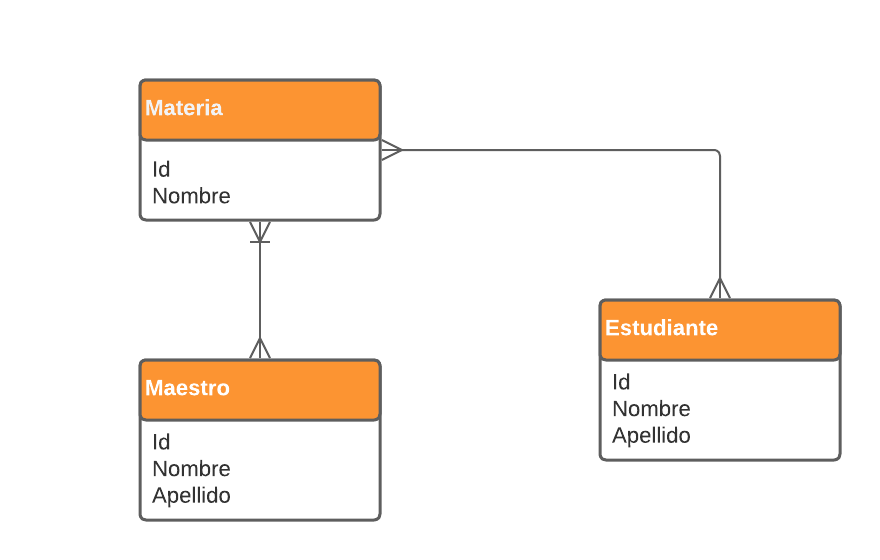

# Documentacion API School
Esta documentacion esta pensada para la instalación y el testeo de la API desarrollada a partir de la prueba de Logyc Systems.

## Instalación
### Paso 1
En primera uno debe de generar un entorno virtual para empezar a trabajar con el proyecto, si bien se pueden instalar los frameworks y componentes de manera local, esta es una mala practica si se considera a futuros otros proyectos con diferentes componentes.

#### Comando para iniciar el setup del entorno virtual 
```python
python -m venv venv
```
Posteriormente deberemos de ejecutar un script llamado *activate* para estar empleando nuestro entorno virtual, para ello ejecutaremos el siguiente comando
#### Comando para iniciar el entorno virtual 
```
.\venv\Scripts\activate
```

### Paso 2
Una vez seteado nuestro entorno virtual debemos de instalar los frameworks y componentes que se utilizaron para el proyecto. Instalar cada componente de manera individual tomaría una cantidad de tiempo considerable, por lo que utilizaremos el siguiente comando para que lea el archivo *Requirements.txt*, el cual contiene una lista de los componentes empleados.

#### Comando para iniciar la instalación de los componentes
```python
pip install -r requirements.txt
```
### Paso 3
Una vez instalado nuestros componentes unicamente nos hara faltar ejecutar un par de comandos para setear nuestro modelos en nuestra base de datos, para ello ejecutaremos los siguientes codigos.
#### Comando para iniciar la instalación de los componentes
```python
python manage.py makemigrations school
```

```python
python manage.py migrate
```
Se puede ejecutar el comando de migrate directamente, pero podria decirse que makemigrations es *buena practica*, mas que nada porque el comando crea una serie de archivos en una carpeta llamada migrations para que uno tenga un registro de todos los cambios de la base de datos.

### Paso 4
Por ultimo ejecutaremos el siguiente comando para ejecutar nuestro servidor y experimentar con nuestro API y documentación.
```python
python manage.py runserver
```
Con este comando estariamos inicializando un servidor local con el contenido de nuestro proyecto y respectiva app, para verificar las direcciones disponibles en nuestra API es necesario revisar los archivos *urls.py* en *mysite* y *school*.

# Documentación sobre las relaciones de nuestras entidades
La prueba contenía un enunciado con las siguientes entidades
* Maestro
* Estudiante
* Materia

El siguiente diagrama desarrolla las relaciones entre las entidades 

